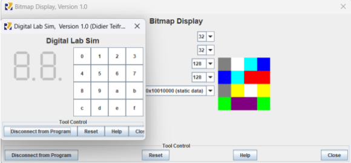
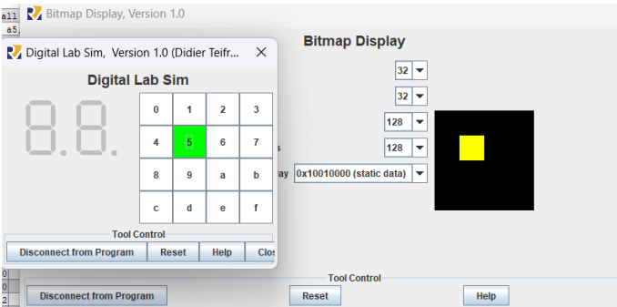
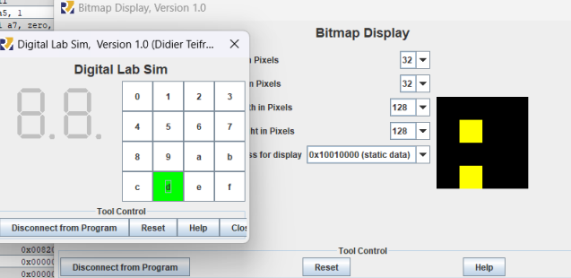
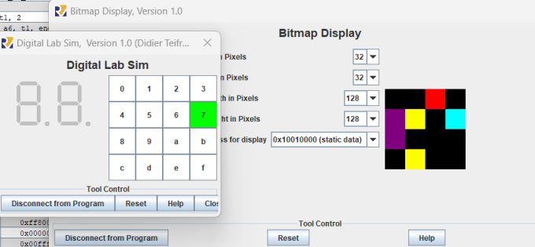
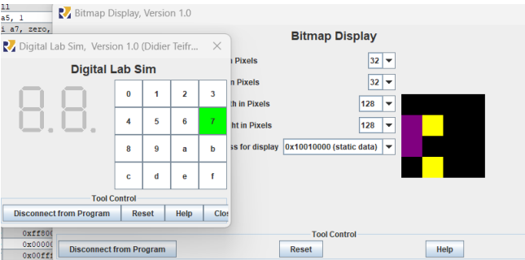
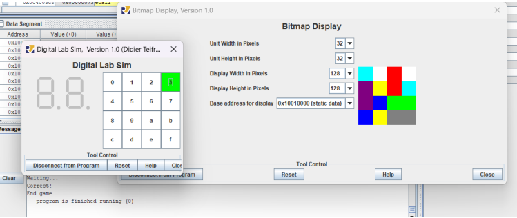

# Description
This project aims to implement a card-flipping game using `risc-v` assembly language. The game is display on the `Bitmap Display` and `Digital Lab Sim` tools.

Display a 4x4 grid of square cards with 8 pairs of colors arranged randomly in the face-down state in a bitmap screen (`Bitmap Display`).

The player flips two card by pressing two keys on the keypad (`Digital Lab Sim`). The corresponding cards are revealed.

If the two flipped cards have the same color, they remain the face-up state. If the colors differ, they flip back down.

The game ends when all cards are flipped face-up.

# Game Visualization

## The randomly color initalization

## How to play ?

When player chooses the button 5 on `Digital Lab Sim`, the corresponding card in `Bitmap Display` is fliped.

If 2 cards flipped have the `same color`, these will remain face-up until the end of game.

If 2 cards flipped have the `different color`, these will face-down again.

The game is ended. When all the card is flipped, And a message `End Game` will be displayed.

